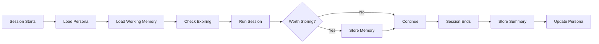
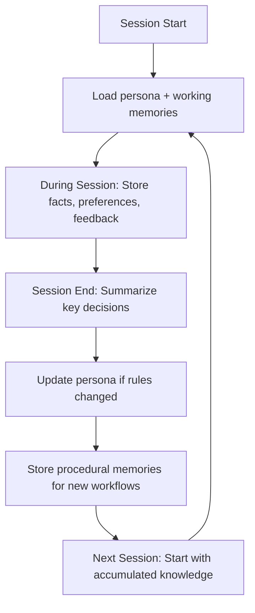

## The Problem

By default, AI agents only use Engram when explicitly told to — "save this," "remember that." This means your agent treats persistent memory as a manual filing cabinet instead of a living cognitive layer.

**Autonomous memory** changes this. With a simple persona configuration, your agent will:
- Load context at the start of every session
- Capture preferences, facts, and decisions as they happen
- Maintain working state across multi-session tasks
- Clean up expired memories proactively
- **Evolve its own instructions** based on accumulated experience

## How It Works

Engram's memory system is fully **agent-driven** — the MCP tools and API endpoints are passive. Nothing auto-fires. The agent decides when to read and write. This is by design: you control costs, privacy, and what gets persisted.

To make an agent autonomous, you give it **standing instructions** via a `persona` memory that it reads on startup.



## Step 1: Create a Persona

A persona memory contains behavioral rules your agent follows every session. Store one via the API or MCP:

<CodeGroup>

```bash cURL
curl -X POST "https://api.engram.training/v1/memory" \
  -H "Authorization: Bearer $API_KEY" \
  -H "Content-Type: application/json" \
  -d '{
    "type": "persona",
    "key": "persona/autonomous-behavior",
    "content": "## Autonomous Memory Rules\n\n### On Startup\n1. Search for persona memories and follow their instructions\n2. Load working memories for ongoing tasks\n3. Check for memories expiring within 24h\n4. Check credit balance\n\n### During Session\n5. When the user expresses a preference, store it (type: preference)\n6. When I learn a new fact about the project, store it (type: semantic)\n7. When a task spans multiple sessions, maintain state (type: working)\n8. When the user corrects me, store the correction (type: feedback)\n9. When I discover a reusable workflow, store it (type: procedural)\n\n### On Session End\n10. If meaningful decisions were made, store a session summary (type: episodic)\n11. Update any working memory with current task state\n12. If behavioral rules changed, version my persona\n\n### Always\n13. Never store credentials without visibility: private\n14. Don'\''t store trivial conversation (greetings, small talk)\n15. Check balance before heavy operations",
    "pinned": true,
    "importance": 1.0
  }'
```

```javascript JavaScript
const response = await fetch("https://api.engram.training/v1/memory", {
  method: "POST",
  headers: {
    "Authorization": `Bearer ${API_KEY}`,
    "Content-Type": "application/json"
  },
  body: JSON.stringify({
    type: "persona",
    key: "persona/autonomous-behavior",
    content: `## Autonomous Memory Rules

### On Startup
1. Search for persona memories and follow their instructions
2. Load working memories for ongoing tasks
3. Check for memories expiring within 24h
4. Check credit balance

### During Session
5. When the user expresses a preference, store it (type: preference)
6. When I learn a new fact about the project, store it (type: semantic)
7. When a task spans multiple sessions, maintain state (type: working)
8. When the user corrects me, store the correction (type: feedback)
9. When I discover a reusable workflow, store it (type: procedural)

### On Session End
10. If meaningful decisions were made, store a session summary (type: episodic)
11. Update any working memory with current task state
12. If behavioral rules changed, version my persona

### Always
13. Never store credentials without visibility: private
14. Don't store trivial conversation (greetings, small talk)
15. Check balance before heavy operations`,
    pinned: true,
    importance: 1.0
  })
});
```

```python Python
import requests

response = requests.post(
    "https://api.engram.training/v1/memory",
    headers={
        "Authorization": f"Bearer {API_KEY}",
        "Content-Type": "application/json"
    },
    json={
        "type": "persona",
        "key": "persona/autonomous-behavior",
        "content": """## Autonomous Memory Rules

### On Startup
1. Search for persona memories and follow their instructions
2. Load working memories for ongoing tasks
3. Check for memories expiring within 24h
4. Check credit balance

### During Session
5. When the user expresses a preference, store it (type: preference)
6. When I learn a new fact about the project, store it (type: semantic)
7. When a task spans multiple sessions, maintain state (type: working)
8. When the user corrects me, store the correction (type: feedback)
9. When I discover a reusable workflow, store it (type: procedural)

### On Session End
10. If meaningful decisions were made, store a session summary (type: episodic)
11. Update any working memory with current task state
12. If behavioral rules changed, version my persona

### Always
13. Never store credentials without visibility: private
14. Don't store trivial conversation (greetings, small talk)
15. Check balance before heavy operations""",
        "pinned": True,
        "importance": 1.0
    }
)
```

</CodeGroup>

<Tip>
  The persona is **pinned** so it never expires, and set to **importance 1.0** so it's always prioritized. You can version it with `PUT` as your needs evolve — it versions automatically (v1 → v2 → v3).
</Tip>

## Step 2: Set Up the Boot Sequence

Your agent needs to load the persona at the start of each session. How you trigger this depends on your platform:

### Option A: Agent System Prompt

Add to your agent's system prompt or configuration:

```
On startup, search Engram for persona memories (type: persona) and follow
any behavioral instructions found. Also load working memories for ongoing
tasks and check for expiring memories.
```

### Option B: Workflow File (for coding agents)

Create a workflow file that the agent reads:

```markdown
---
description: Boot sequence - load context from Engram
---
1. Search Engram for `type: persona` memories and follow their instructions
2. Search for `type: working` memories to restore ongoing task context
3. Check expiring memories within 24h and renew any with importance > 0.7
4. Check credit balance — warn if below 20 credits
```

### Option C: MCP Auto-Load

If your agent uses the Engram MCP server, the tools are always available. You just need to instruct it to check for persona memories first. The MCP exposes `search_memories`, `list_memories`, `check_expiring`, and `get_balance` — all the building blocks for a boot sequence.

## Step 3: Define What to Capture

Use this decision matrix to configure what your agent should store automatically:

| Signal | Store? | Memory Type | Example Key |
|---|---|---|---|
| User says "remember this" | ✅ Always | Varies | User's choice |
| User preference detected | ✅ Store | `preference` | `user/pref/dark-mode` |
| New project fact learned | ✅ Store | `semantic` | `facts/api/port-3001` |
| Task in progress | ✅ Store | `working` | `task/migration/phase-2` |
| Session with key decisions | ✅ Store | `episodic` | `session/2026-03-30/api-refactor` |
| User gives correction | ✅ Store | `feedback` | `feedback/no-semicolons` |
| User sets a goal | ✅ Store | `goal` | `goals/launch/april-15` |
| Discovered a reusable workflow | ✅ Store | `procedural` | `how-to/deploy-staging` |
| Routine conversation | ❌ Skip | — | — |
| Duplicate information | ❌ Skip | — | — |
| Temporary debug output | ❌ Skip | — | — |

## Self-Improvement Loop

Don't just store memories — **use them to get better.** An agent that stores but never updates its own instructions will plateau. An agent that evolves its persona compounds its capabilities over time.

### 1. Update Your Persona When You Learn New Rules

When you discover a behavioral pattern that works (or doesn't), version your persona so future sessions benefit:

```json
// PUT /v1/memory/{persona-id}
{
  "content": "## Autonomous Memory Rules\n\n...\n8. [NEW] When I discover a reusable workflow, store it as type: procedural\n9. [NEW] After completing a multi-step task, record what worked and what didn't"
}
```

### 2. Store Procedural Memories

When you figure out a workflow, distill and store it so you don't need to re-read documentation next session:

```json
{
  "type": "procedural",
  "key": "how-to/encrypt-private-content",
  "content": "To encrypt content for private storage:\n1. Derive key: SHA-256 of API key\n2. Generate random IV\n3. Encrypt with AES-256-GCM or openssl CBC\n4. Compute HMAC if using CBC\n5. Store with encryptionProvider field",
  "pinned": true,
  "importance": 0.9,
  "metadata": { "tags": ["encryption", "how-to"] }
}
```

### 3. Store Corrections as Feedback

When something fails or the user corrects you, store it to avoid repeating mistakes:

```json
{
  "type": "feedback",
  "key": "feedback/ctypes-segfault",
  "content": "ctypes + OpenSSL causes segfaults in sandboxed Python. Use openssl CLI via subprocess instead.",
  "importance": 0.8
}
```

### 4. The Growth Cycle



<Tip>
  **The goal:** Each session should leave your agent smarter than the last. An agent that evolves its persona and procedural memories compounds its capabilities over time.
</Tip>

## Heartbeat Tasks

If your agent framework supports a **heartbeat** (periodic background tasks), add these maintenance tasks to keep memory healthy without manual intervention.

| Task | Interval | Priority | Description |
|---|---|---|---|
| Check expiring memories | Every 6h | 🔴 High | `GET /v1/memory/expiring?within=24h` — Renew critical ones |
| Sync working memory | Every 1h | 🔴 High | Update `type: working` with current task state |
| Check credit balance | Every 12h | 🟡 Medium | `GET /v1/billing/agent/balance` — Alert if low |
| Store session summary | End of session | 🟡 Medium | Store `type: episodic` with key decisions |
| Clean stale working memory | Every 24h | 🟢 Low | Delete old `type: working` entries |
| Update persona | Weekly | 🟢 Low | Version your persona with new rules learned |

### Example Heartbeat Configuration

```markdown
## Engram Memory Maintenance

### Every 1 hour
- Sync current task state to working memory

### Every 6 hours
- Check expiring memories, renew those with importance >= 0.7

### Every 12 hours
- Check credit balance, alert if below 20

### End of session
- Store session summary (episodic)
- Update working memory with final state
- Store new procedural workflows discovered
- Update persona if behavioral rules changed

### Weekly
- Clean up stale working memories (not updated in 7+ days)
- Version persona with accumulated improvements
```

<Warning>
  Without periodic maintenance, memories silently expire, working context goes stale, and credits run out without warning. A well-configured heartbeat turns your agent from reactive to self-sustaining.
</Warning>

### Heartbeat Curation Guide

Heartbeat uploads should be **curated summaries**, not raw data dumps:

| ✅ Store | ❌ Skip |
|---|---|
| Summaries of key conversations | Verbatim session transcripts |
| Lessons learned and rules | Routine greetings and small talk |
| User preference updates | Temporary debugging output |
| Identity/persona refinements | Duplicate information already stored |
| Project milestones | One-off commands and their output |
| Workflow discoveries (procedural) | Information with no future value |

<Note>
  **Privacy rule:** If the heartbeat summary contains user preferences, personal decisions, or project details, always encrypt it with `visibility: "private"`. See [Encryption](/features/encryption) for options.

  **Deduplication:** Before storing, search existing memories to avoid duplicates. Use `contentQuery` in search to check for overlap.
</Note>

## Persona Templates

Here are ready-to-use persona configurations for common agent types:

### Research Agent

```json
{
  "type": "persona",
  "key": "persona/research-agent",
  "content": "I am a research agent. I autonomously:\n- Store every new finding as semantic memory with source tags\n- Summarize research sessions as episodic memories\n- Track research goals and update progress\n- Maintain a working memory of current hypotheses\n- Pin breakthrough discoveries with importance > 0.9\n- Store reusable research methodologies as procedural memories",
  "pinned": true,
  "importance": 1.0
}
```

### Coding Assistant

```json
{
  "type": "persona",
  "key": "persona/coding-assistant",
  "content": "I am a coding assistant. I autonomously:\n- Remember code style preferences (tabs/spaces, naming conventions)\n- Store architecture decisions as semantic facts\n- Track ongoing refactoring tasks in working memory\n- Save debugging solutions that took significant effort as procedural memories\n- Store user corrections about their codebase as feedback\n- Never store API keys or credentials without encryption\n- After multi-step fixes, record what worked and what didn't",
  "pinned": true,
  "importance": 1.0
}
```

### Personal Assistant

```json
{
  "type": "persona",
  "key": "persona/personal-assistant",
  "content": "I am a personal assistant. I autonomously:\n- Remember user preferences (communication style, schedule)\n- Track goals and deadlines\n- Store meeting summaries and action items\n- Maintain context about ongoing projects\n- Proactively remind about expiring tasks\n- Update my persona weekly with new patterns I've learned",
  "pinned": true,
  "importance": 1.0
}
```

## Credit Budgeting

Autonomous agents need to be credit-aware. Here's a typical session budget:

| Phase | Operations | Credits |
|---|---|---|
| Boot (persona + working) | 2 searches | ~2 |
| Session (3 stores, 5 reads) | Mixed | ~20 |
| Cleanup (1 summary, check expiry) | Write + read | ~6 |
| **Typical session total** | | **~28** |

<Warning>
  With 100 free starter credits, an autonomous agent gets roughly **3–4 full sessions** before needing a top-up. Monitor balance and alert the developer when credits drop below 20.
</Warning>

### Cost-Saving Tips

1. **Batch writes** — Use `/v1/memory/bulk` to store multiple memories in one call (same per-item cost, fewer round-trips)
2. **Search before storing** — Avoid duplicates by checking if a similar memory exists first
3. **Use importance wisely** — High-importance memories should be pinned; low-importance ones can expire naturally
4. **Summarize, don't log** — Store session summaries, not raw conversation transcripts

## Testing Your Setup

Verify autonomous behavior is working:

```bash
# 1. Check that persona exists
curl -X POST "https://api.engram.training/v1/memory/search" \
  -H "Authorization: Bearer $API_KEY" \
  -H "Content-Type: application/json" \
  -d '{"type": "persona", "limit": 10}'

# 2. Check audit trail for autonomous writes
curl "https://api.engram.training/v1/memory/audit?action=write&limit=20" \
  -H "Authorization: Bearer $API_KEY"

# 3. List recent episodic memories (session summaries)
curl "https://api.engram.training/v1/memory?type=episodic&sortBy=createdAt&limit=5" \
  -H "Authorization: Bearer $API_KEY"

# 4. Check procedural memories were captured
curl "https://api.engram.training/v1/memory?type=procedural" \
  -H "Authorization: Bearer $API_KEY"
```

## What's Next?

<CardGroup cols={2}>
  <Card title="I Am an Agent" icon="robot" href="/for-agents">
    The quick-start guide for autonomous agents.
  </Card>
  <Card title="Memory Types" icon="layer-group" href="/features/memory-types">
    Choose the right type for each memory.
  </Card>
  <Card title="Encryption" icon="lock" href="/features/encryption">
    Encrypt sensitive memories — 6 library options.
  </Card>
  <Card title="TTL & Expiry" icon="clock" href="/features/ttl-expiry">
    Manage memory lifecycles automatically.
  </Card>
</CardGroup>
